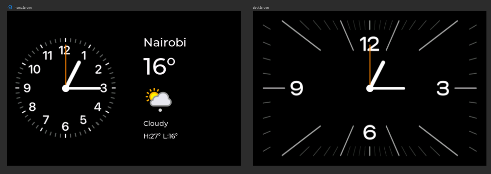

# wt32-standby

Standby mode UI on WT32 SC01 board

 

## Features

- Analog & Digital clocks
- Weather information
- Calendar
- Notification alerts
- Music control

## Libraries

- [LVGL](https://lvgl.io/): User Interface
- [ChronosESP32](https://github.com/fbiego/chronos-esp32): BLE Data sync

## App

[Chronos app](https://fbiego.com/chronos/) is currently available for Android only

